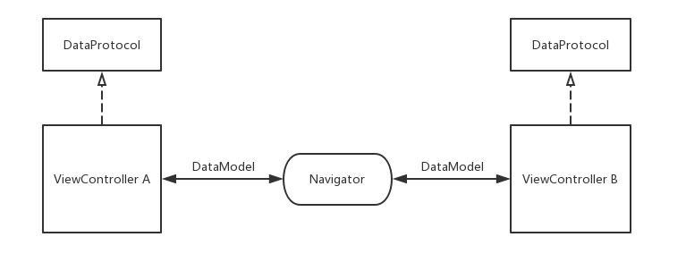

# Navigator

[](https://github.com/iKrisLiu/Navigator/releases)


Navigator is a generic navigation framework for view controllers. It can decouple the dependency of different modules/components/view controllers.

## Features
- Data passing between view controllers bidirectional, inject data provider implementation for mocking data.
- Navigation between view controllers with system default or custom transition animation
- Support deep link and universal link
- Goto any navigator

## Architecture
<p align="center"></p>
<p align="center"></p>

## Installation
### Swift Package Manager
The [Swift Package Manager](https://swift.org/package-manager/) is a tool for automating the distribution of Swift code and is integrated into the `swift` compiler. To integrate Navigator into your Xcode project, specify it in your `Package.swift`.

```swift
dependencies: [
    .package(url: "https://github.com/iKrisLiu/Navigator", from: "1.0.0")
]
```

[Carthage](https://github.com/Carthage/Carthage) is a decentralized dependency manager that builds your dependencies and provides you with binary frameworks. To integrate Navigator into your Xcode project using Carthage, specify it in your `Cartfile`:

```ogdl
github "iKrisLiu/Navigator" ~> 1.0
```

### CocoaPods
[CocoaPods](https://cocoapods.org) is a dependency manager for Cocoa projects. To integrate Navigator into your Xcode project using CocoaPods, specify it in your `Podfile`:

```ruby
pod 'SmartNavigator', '~> 1.0'
```

## Usage
### Initialize Root View Controller

##### NavigatonControler
```swift
func application(_ application: UIApplication, didFinishLaunchingWithOptions launchOptions: [UIApplication.LaunchOptionsKey: Any]?) -> Bool {
    // View controller class name (The swift class name should be "ModuleName.ClassName")
    let main = DataModel(viewController: NSStringFromClass(UIViewController.self), navigationController: NSStringFromClass(UINavigationController.self), mode: .reset)
    
    Navigator.root.window = window
    Navigator.root.show(main)
    
    return true
}
```

##### SplitViewControler
```swift
func application(_ application: UIApplication, didFinishLaunchingWithOptions launchOptions: [UIApplication.LaunchOptionsKey: Any]?) -> Bool {
    let master = DataModel(viewController: "MasterViewController", navigationController: NSStringFromClass(UINavigationController.self))
    let detail = DataModel(viewController: "DetailViewController", navigationController: NSStringFromClass(UINavigationController.self))
    let split = DataModel(viewController: "SplitViewController", children: [master, detail])
    
    Navigator.root.window = window
    Navigator.root.show(split)
    
    return true
}
```

##### TabBarControler
```swift
func application(_ application: UIApplication, didFinishLaunchingWithOptions launchOptions: [UIApplication.LaunchOptionsKey: Any]?) -> Bool {
    let firstTab = DataModel(viewController: "TabItemViewController", navigationController: NSStringFromClass(UINavigationController.self))
    
    let master = DataModel(viewController: "MasterViewController", navigationController: NSStringFromClass(UINavigationController.self))
    let detail = DataModel(viewController: "DetailViewController", navigationController: NSStringFromClass(UINavigationController.self))
    let secondTab = DataModel(viewController: "SplitViewController", children: [master, detail])
    
    let tabs = DataModel(viewController: NSStringFromClass(UITabBarController.self), mode: .reset, children: [firstTab, secondTab])
    
    Navigator.root.window = window
    Navigator.root.show(tabs)
    
    return true
}
```

### DeepLink
```swift
func application(_ app: UIApplication, open url: URL, options: [UIApplication.OpenURLOptionsKey: Any] = [:]) -> Bool {
    let main = DataModel(viewController: NSStringFromClass(UIViewController.self), navigationController: NSStringFromClass(UINavigationController.self), mode: .reset)
    let middle = DataModel(viewController: NSStringFromClass(UIViewController.self))
    let top = DataModel(viewController: NSStringFromClass(UIViewController.self))
    
    Navigator.current.show(top)     // Show top view controller base on current vc stack
    Navigator.root.show(main --> middle --> top)    // Reset root view controller
    
    return true
}
```

### Show / Dismiss
```swift
class DetailViewController: UIViewController {
    @objc private func onTapShowViewControler() {
        let data = DataModel(viewController: NSStringFromClass(UIViewController.self), mode: .push)
        let data = DataModel(viewController: NSStringFromClass(UIViewController.self), mode: .present, title: "Hello", additionalData: "You can pass any type object")
        
        navigator?.show(data)
    }
    
    @objc private func onTapDismissViewControler() {
        let data = DataModel(additionalData: "You can pass any type object")
        
        navigator?.dismiss()            // 0: dimiss current view controller, 1: dismiss top two view controllers.
        navigator?.dismiss(level: -1)   // Dismiss to root view controller of current navigator
        navigator?.dismiss(data)        // Pass data to previous view controller when dismiss
    }
}
```

### Transition Animation
Create custom transition class inherits the `Transition` class and override below two methods. Then pass transition class with custom transition class name in data model.

```swift
class CustomTransition: Transition {
	public override func animateNavigationTransition(from fromView: UIView?, to toView: UIView?) { }
	public override func animatePresentingTransition(from fromView: UIView?, to toView: UIView?) { }
}

class DetailViewController: UIViewController {
    @objc private func onTapShowViewControler() {
        let data = DataModel(viewController: NSStringFromClass(UIViewController.self), mode: .present, transitionStyle: .flipHorizontal)
        let data = DataModel(viewController: NSStringFromClass(UIViewController.self), mode: .present, transitionClass: "CustomTransition")

        navigator?.show(data)
    }
}
```

### Data Passing
```swift
class DetailViewController: UIViewController, NavigatorDataProtocol {
    private var data: Any?
    
    // Receive this callback when open by other view controller
    func onDataReceiveBeforeShow(_ data: DataModel, fromViewController: UIViewController?) {
        title = data.title
        data = data.additionalData
    }
    
    // Receive this callback when dismiss from next view controller
    func onDataReceiveAfterBack(_ data: DataModel, fromViewController: UIViewController?) {
        data = data.additionalData
    }
}
```
